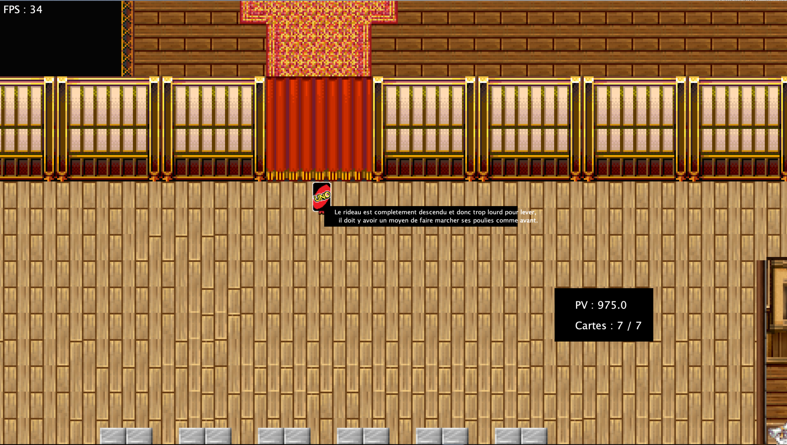
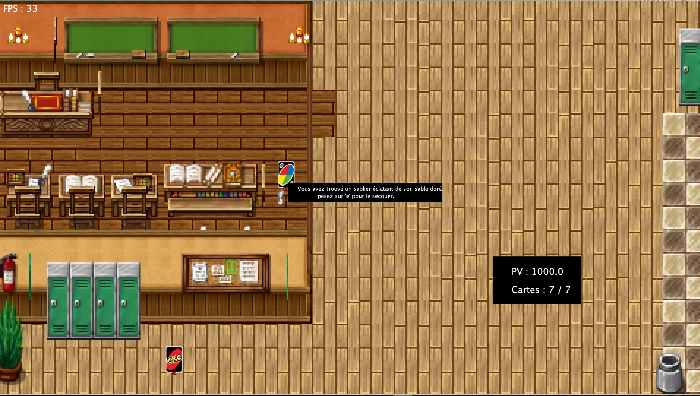
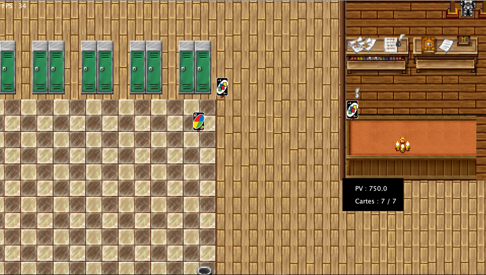
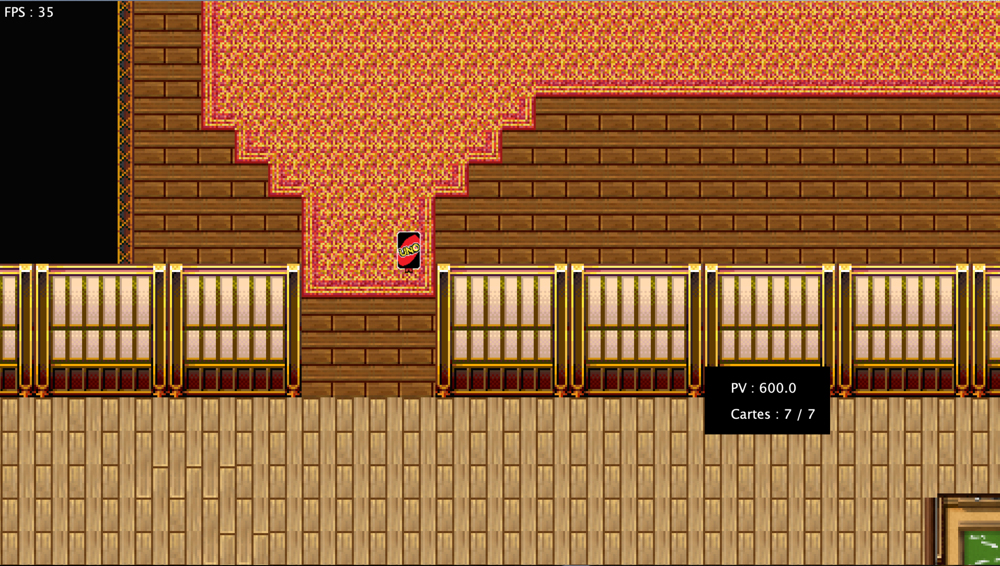
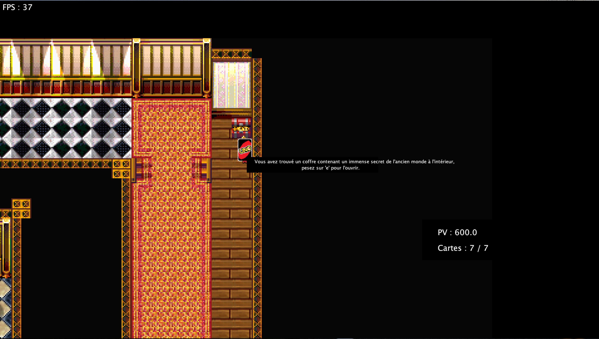
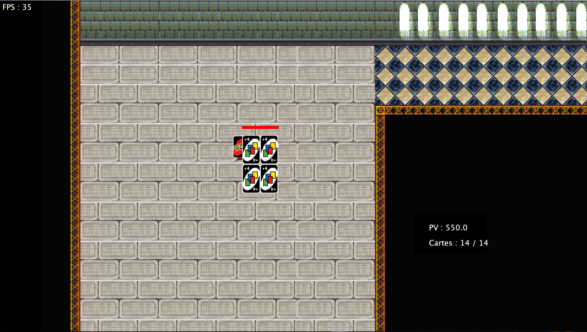

# Uno Game
## Concept
Il fallait concevoir un jeu Java en utilisant un game engine custom fait avec l'aide de notre [professeur](https://github.com/dadajuice) pendant les cours. Le jeu consiste a jouer en tant qu'une carte change de couleur du jeu Uno, qui doit combattre les cartes +4 ainsi que leur chef. Il y a un puzzle a régler avant de pouvoir accéder à la section finale du jeu ainsi qu'une amélioration cachée de l'attaque de base et un easter egg faisant référence à un jeu d'un autre élève.

## Média(s)

### Première section

### Sablier

### Ennemis

### Deuxième section

### Amélioration attaque

### Boss

## Technologies
- Java
- Spritesheets custom pour le joueur et les ennemis fait avec [GIMP](https://www.gimp.org). 
- Carte de jeu créée avec [Tiled](https://www.mapeditor.org).
- Fichier de collisions en JSON
- Pathfinding très rudimentaire
- Musique de fond et sons d'actions
